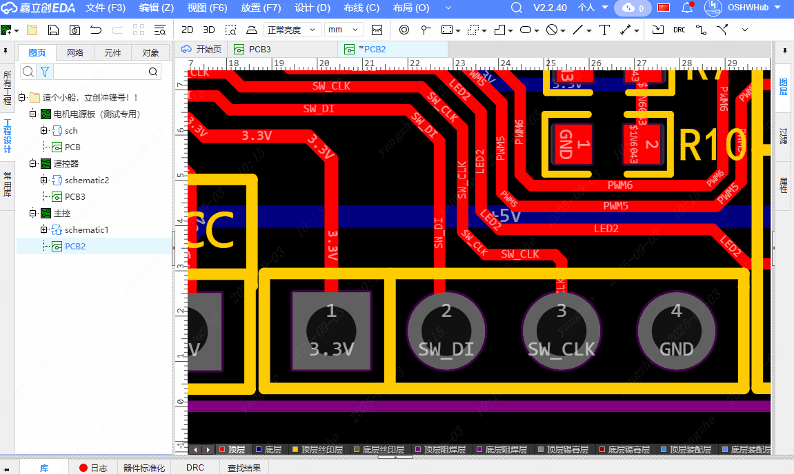

# Generate Pad Silkscreen

[中文](./README.md)

This extension automatically generates text or images for the silkscreen layer based on the pad's net name, making it easy to add net name silkscreen labels during PCB design. It supports batch automatic generation, making it very convenient.

# Instructions

  
1. Click the Generate Pad Silkscreen menu.  
2. After setting the parameters, box-select the pads corresponding to the nets you want to generate silkscreen for.  
3. Box-select the area to determine the placement position, and the silkscreen will be automatically placed.

# Tips

1. Placing text silkscreen requires version V3 or above.

2. When box-selecting the placement area, selecting from left to right will left-align the silkscreen, and selecting from right to left will right-align the silkscreen.
