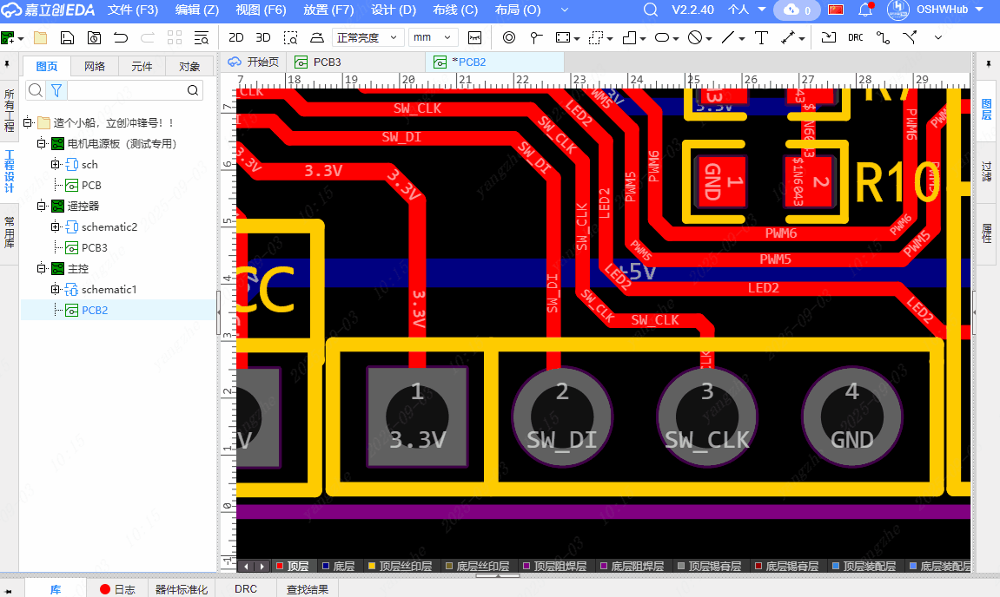

# 生成焊盘丝印

这个扩展是根据焊盘的网络名称，自动生成丝印层的文本或者图片，方便在PCB设计时添加网络名的丝印标签，可以支持批量自动生成，非常方便

# 使用方法

  
1、点击生成焊盘丝印菜单。  
2、设置参数后，框选所需要的生成的丝印对应的网络的焊盘。  
3、再框选区域确定要摆放的位置，会自动放置丝印。

# 提示

1、放置文本丝印需要在V3及以上版本

2、框选放置区域时，左到右框选丝印将左对齐，右到左框选丝印将右对齐

# Generate Pad Silkscreen

This extension automatically generates text or images for the silkscreen layer based on the pad's net name, making it easy to add net name silkscreen labels during PCB design. It supports batch automatic generation, making it very convenient.

# Instructions

1. Click the Generate Pad Silkscreen menu.

2. After setting the parameters, select the pad corresponding to the net you want to generate the silkscreen for.

3. Select the area to place the silkscreen. The silkscreen will automatically align with the pad and be placed.

# Tips

1. Placing text silkscreen requires version V3 or above.

2. When selecting the placement area, select from left to right to align the silkscreen to the left, and from right to left to align the silkscreen to the right.
